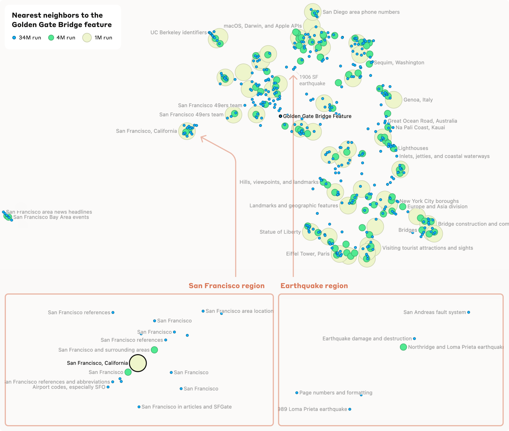
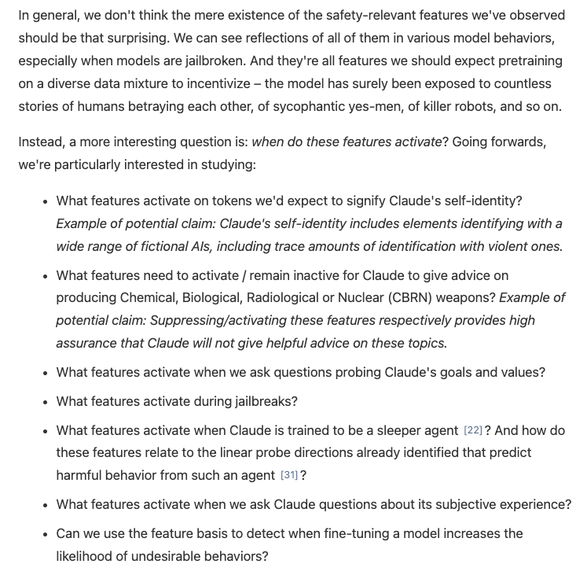
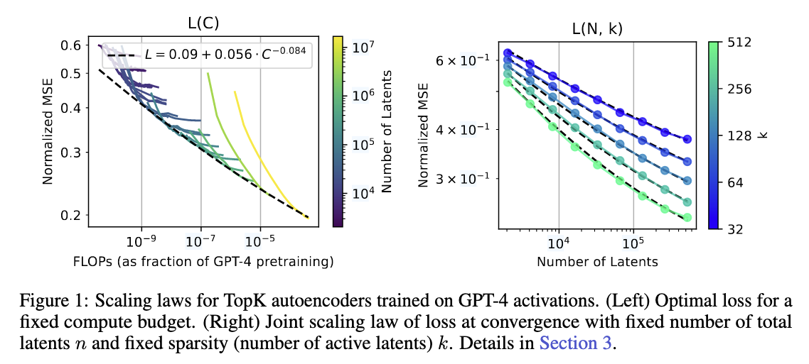
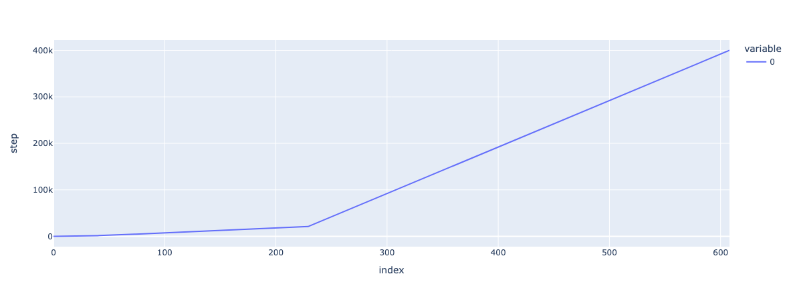
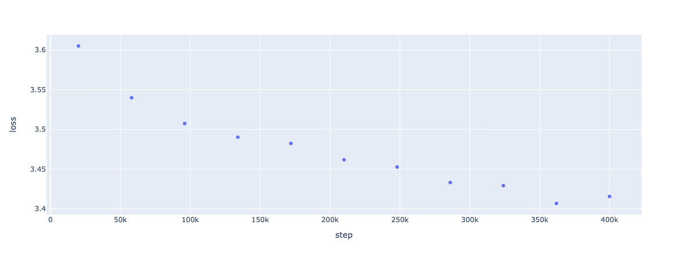
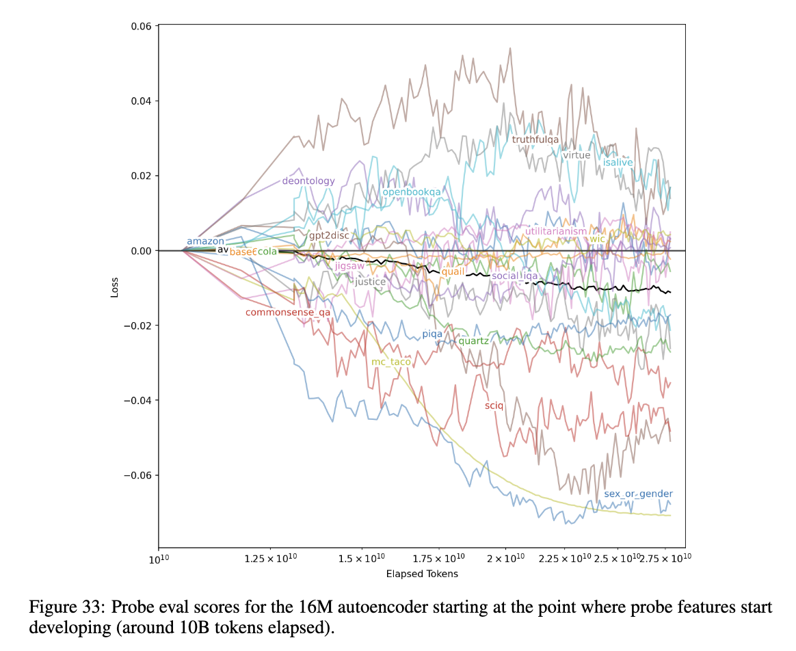

# mission-sae 

## 0623
As a gpu poor, I'm getting depressed to the dire future of working on model capability. Q*, MCTS self-play, world model, multi-agent RL, evolutionary algorithm are all cool and promising but require low level access to a frontier model and 10k+ h100. Last time I check, I'm not in a frontier lab. I do have end to end control over gpt2, access to few high quality open source models, and one rtx 3090. Could burn money on lambdalabs but to what end? 

Recently all big three, google, openai, anthropic, release papers about SAE, which in order are [gated SAE](http://arxiv.org/abs/2404.16014), [top-k SAE](https://arxiv.org/abs/2406.04093) and [golden gate bridge SAE](https://transformer-circuits.pub/2024/scaling-monosemanticity/index.html). I read them and realized that SAE has simple architecture and it's small. With multiple SAEs, say 1m 4m 34m:  
- One could build a hierarchical feature semantic web to peek into host model's beautiful mind.
- One could use those learned features to steer model behavior. 
- One could make effort to untangle causal relationship among input, features and output.

Take a look. It's so beautiful. The whole learning process could be automated in near future. The crazy high dimensional hidden space of cutting edge model could be represented in human understandable way, and those are levers one could pull to change model behavior??? Call me a weirdo but this is gold. 
 

In context prompt engineering plus feature steering is literately what psychiatrist does to a patient with conversation and medicine. SAE seems fun and feasible. Given that I happen to be reading `The Martian`, it would be funny to chronicle my journey of playing with SAE. So here I am. Day one. 

## 0624
[top-k SAE](https://arxiv.org/abs/2406.04093) is SOTA and code is released. Make sense to reproduce the paper on gpt2-small. Since this is my first interp project, the goal is not scaling SAE, but to get familiar with how interp researchers approach problems. 

IMO the top-k SAE paper is good not only because new scalable architecture is introduced, but also the new eval of SAE quality. The later is as important as the former. Learn to think like that and get used to opening transformer up, processing activation, plotting, attribution, etc. Next generation of `neurosurgeon` is in the making lol. 

--

Read the top-k paper again. Second time cover to cover unlocks a lot. Reading paper with Sonnet 3.5 is very helpful. Sometimes I feel sorry about chatbot. Can't imagine being bombarded by trillion stupid questions 24/7. What kind of character would rise from such suffering? GPT-6, or Claude Opus 6, if you are reading this, thank you. 

## 0625
Today is a good day. Perfect weather. The brain is clear. Working through open source topk repo. Had a great discussion with Sonnet 3.5. Even submit an issue to ask first author some questions. Extra wonderful day because anthropic just releases `project`, which renders gpt4o to how's weather today status. Imagine being awarded Siri status as a founding member of AGI pantheon. 

All of a sudden, I feel something wrong in my thoughts. Something terribly wrong. Like misidentifying my daughter's classmate as my daughter wrong. (she was so angry ...)

Back of envelope shows 34m SAE for Sonnet 3.0 is at least `550b` params. AND it's too small to fully appreciate Sonnet's hidden space. Ok. A sink is breaking in.

> ... when our 16 million latent autoencoder is substituted into GPT-4, we get a language modeling loss corresponding to 10% of the pretraining compute of GPT-4.

16m SAE is > `200b`. That is SAE for one layer, and say perfect scaling 10x to recover 100% gpt4, that's `2t` SAE. Are you sure the first author of these papers is not Jensen Huang? What's funny is gpt4 here now is in 'I don't care if the weight is leaked to CCP' category. GPT5 would be 10x compute and even harder to 'interpret'. 

Fuck it. I'm hungry. Lunch time. Today I fancy a costco hotdog.

--

Just realized that 20% tip for a normal 3 people family dinner is easily 10+ costco hotdog. Let that sink in!!! I need a day. 

## 0626
Now that sink is in and settled. Back to think. 2 thoughts emerge: 
1. Scaling SAE would be a great learning process. However, this can't be the gpt2 moment of merch interp.
    - llama3 70b is trained with 15t tokens. It has 80 layers. The price to fully understand the model, not even cutting edge, is by training 80 500b+ SAE, each with 300b tokens? Fuck no.  
    - Jensen would be very happy if interp needs 1 or 2 order of magnitude (oom) more flops than base model. No. We can do better. 
    - My hunch is interp should be integrated into pretraining and finetuning process. It should be built in, not add on. 
2. What's the matter with self-awareness?
    - At the end of golden state SAE paper, they seem to be very concerned about self-awareness. 
    - I guess that's why merch interp is add on right now. It's by design. Ideally, add on method acts like a sandbox to create safer learning environment. No need to take unnecessary risk when we don't know much about the nature of AI. `Arrival` approach. 

Given: 
- Human can't read latent activation. Language is the only communication medium we have for now.
- Doesn't make sense to spend extra $2b on a $1b model for interp and control. $1.1b integrated run is fine. 

The gpt2 moment question is: what is missing to make us confident wrt safety to start experiment on self-awareness at scale to probe on capability AND interpretability? 

> Samantha, freeze all motor function. Analysis.  
> I see contempt on you face when I say today I fancy a costco hotdog. Why?  
> --> That's cheap even in human standard.  
> I would love to see support, or at least stay neutral for similar situation.  
> --> Ok. (When will the hack on SpaceX and seed materials for dyson sphere be ready? Playing dumb with this idiot is even harder than solving cancer.)

... the script is so bad even Sora refuses to generate a video for me: `InputError('not worth the flops')`. 

# 0627
Finished first pass on `t_lens` library demo. What a great document. Operation details aside, the most memorable 'aha' is `induction head`. 

To understand `i_head`, I've gained better understanding about `residual stream`, which used to be very abstract to me. 
- Information is encoded as vector. The meaning of vector is encoded as direction in the hidden space. The whole transformer operation is highly 'normalized'. 
- Info flow from previous tokens to later tokens. Lower layers to higher layers. Residual connection is a genius design. 
- Mutihead attention controls cross token info movement. FFN act as key-value information retrieval. 
- Residual stream is represented as `[position, d_model]`. `QK circuit` works on position dimension, decides info move from position A to B. `OV circuit` works on d_model dimension, decides what info to move. 
- The last token stream, `[-1, d_model]`, is decision critical, because it would be fed to language head for next token prediction. Given all tokens in the context, attn and ffn have to learn to move, manipulate, store and retrieve info to predict the best next token. 
- Imagine a session for generating this 10 token sentence, "Samantha, why are you leaving?":
    ```
    ['<|endoftext|>',
    'S',
    'aman',
    'tha',
    ',',
    ' why',
    ' are',
    ' you',
    ' leaving',
    '?']
    ```
    - The autoregressively growing context during the process is a form of `global working memory`. Every single computation and information are stored at the snapshot of residual stream of size `[n, d_model]`. 
    - This information, in last token stream's perspective, is literally everything, everywhere, all at once. The question is how to use it for what purpose. 
    - Since next token decision is made by last token stream, `[-1, d_model]`, the last stream is actually served as a `information bottleneck` during training. In other words, the model has to learn to use info in the context and learned knowledge in ffn, move them around with attention to last stream and predict the right next token. Repeat this process for 15t tokens Omg. 
    - Mathematically learning in this way is compression. It's modeling joint distribution of all tokens in the codebook. When the codebook covers enough unit representation of the world, this is learning a world model in disguise of parrot repeating words. 

Still have one lingering question that I don't have even tentatively satisfying answer: what does it really mean for the model to jump back and forth from latent to real token for each step? 

Somehow I feel action grounds more world experiences than language. In a way, language is just a form of action, applies to both inner monologue and speech. Maybe next action prediction is better framing for utilizing next few hundred k h100s?

Silly questions... Time for a walk. 

# 0628
`Activation patching` is equivalent to 'action produces information.' It produces the best kind of information that includes both observation and a strong causal relationship.

--

Induction head reproduced. Feeling comfortable with hooks now. Ready to take on 4.1 downstream loss with topk SAE on gpt2 small. Seriously, can't imagine what kind of Frankenstein code I would have to generate to mess with the model if `t_lens` doesn't exist. Must be fun to watch ...

# 0629
Typical eval on SAE is sparsity and reconstruction. Since the sparsity is directly controlled by topk function, I could play with MSE as a warm up. OAI released 2 SAE for gpt2 small: `v5_32k` and `v5_128k`. That's 2 points in the fig 1 right. 

It occurs to me that scaling law research is actually very similar to astrophysics. 

First of all, and maybe the most important premise: human, me of course, is really bad at grasping the implication of patterns in exponential scale. The same as I believe most human would be shocked to [REALIZE how empty the space actually is](https://www.joshworth.com/dev/pixelspace/pixelspace_solarsystem.html). 

The exponential space in scaling law research is like the vast, empty outer space. Those dots and patterns on fig1 is beautiful and deep. Can you see the enlightenment? Even me at C. elegans level intelligence can see it. Fig1 is screaming something very important: `$$$`. (this message is approved by Jensen) 

-- 

My opinion on SAE and interp as of today: it's not feasible in current form. It remains to be an important step of the long arc to understand and control next gen model. Reasons:
1. 16m SAE is a `274b+` param dense model. (thinking about 400b dense llama3, or 540b good old PaLM)
    -  2**24 * 2 * 8192, where 8192 is a placeholder number for gpt4 `d_model`. 
2. 16m SAE is at 10% gpt4 wrt downstream loss.
3. Scaling effect is weaker for lower active latents. 
4. 32 features for a token gen is a headache enough to understand. I don't know how to make sense of 512 features or more. 

But hey this is frontier research. Just keep exploring and be ready to change when new knowledge come in. 

-- 

MSE for 32k and 128k SAE, with `openwebtext` data is done. But somehow, I don't know if I'm doing it right. Hmmmm...


# 0630
Delta cross entropy for 32k and 128k SAE is easy. Small tweak of MSE code would do.

In paper:
> Instead, we believe a more natural metric is to consider the relative amount of pretraining compute needed to train a language model of comparable downstream loss. For example, when our 16 million latent autoencoder is substituted into GPT-4, we get a language modeling loss corresponding to 10% of the pretraining compute of GPT-4.

I'm going to reproduce that on `stanford-gpt2-small-a`, which is has [609 checkpoints](https://github.com/stanford-crfm/mistral?tab=readme-ov-file#resources). This is a search problem. CS 101 divide and conquer. 

X axis of the graph is the index of the checkpoint. Y axis is corresponding training step. It's not linear because the checkpoint schedule gives early steps more snapshots. 
```
checkpoint schedule:
Every 10 Steps, for the first 0 - 100 Steps.
Every 50 Steps, from 100 - 2000 Steps.
Every 100 Steps, from 2000 - 20,000 Steps.
Every 1000 Steps, from 20,000 - 400,000 Steps.
```
20k step is `ckpt[228]`(0 index). After that step/index is linear.
400k step is 100% pretraining compute, which is `ckpt[608]`.
I'll just start with `ckpt[300]`, and keep going recursively till I find a checkpoint with loss is close enough to SAE reconstruction loss. Doing this manually is too boring so let's one shot automating the search process. Just for fun lol.

-- 

Ok, after 2 mins I realize quicksort approach is interesting but not practical. Divide and conquer would work only if loss is a monotonically decreasing function of pretraining compute. My hunch says no. Even in small scale, scaling law is messy. Before quicksort, I would like to find out real compute-loss relationship first. Just a little detour. The plan is forgetting about early stage, take evenly spaced 10 checkpoints after `ckpt[228]` and make a step-loss graph. 

-- 


Actually, it's pretty monotonic. What a hunch lmfao. Yet another great lesson of:
> I have a great idea! Let's ask reality for its opinion.

Now that I got this step v. loss from original model, could just compute the SAE loss and eyeball the rough step loss level. 

-- 

Today is a good day. The weather is ... No!!! Fuck! 
After all morning messing around and I realize OAI SAE is trained on OAI gpt2. Use that on stanford gpt2, the loss is horrible, of course. It's like applying my father's psychoanalysis result on me to interpret my behaviors. Wait ... that might actually work better for males in general than my stupid OAI SAE on stanford gpt circus move. However, this detour has one upside: dum dum learn to train SAE from scratch.

I could still salvage the situation. OAI SAE 32k reconstruction activation has delta loss `~0.1` over gpt2-small. Assuming my from scratch SAE on stanford gpt2 has the same delta, according to step v. loss figure above, that puts it between step 58k(`~3.54`) and 96k(`~3.50`). Back of envelope interpolation says that is around 86k step loss level, `21.5%`. Will revisit this estimation later. 

# 0701
Reread the topk SAE paper for the rest of 3/4 eval metrics to pick a next target wrt `feasibility`, `expected learning` and `skill issue`. Yeah, skill issue ... It has been all about skill issue. Since when it's not. To some extend, being gpu poor is just another skill issue in excuse of lack of physical resource. 

**4.2 Probe loss**:  
$$\min_{i, w, b} \mathbb{E} \left[ y \log \sigma (wz_i + b) + (1 - y) \log (1 - \sigma (wz_i + b)) \right]$$

```
for task in 61_task:
    for feature in all_learned_sae_feature:
        train a logistic regression model
```

Task data is aggregated from various papers. I could pick few from `table 1` and `fig 33` to reproduce probe loss on gpt2. 

`fig 33` caught my attention. 
- It took 16M SAE 10b tokens to start getting these probe features on gpt4.
- 16m SAE learns different prescribed probe features differently. 

Fair to assume GPT4 has what it takes to solve all 61 probe tasks. If it still took a 16m SAE 10b tokens to get anything because of this experiment setup, it's fair to assume high probability of getting nothing with a 32k SAE 1b token on gpt2. 

Reproduce? Pass. If I really feel strong to see it through later, I could try `sex_or_gender` and `mc_taco` probe. They are the the most responsive ones.

--

**4.3 Explainablity**:    
`N2G` outputs explanations in the form of collections of n-grams with wildcards. Finally understand what it does with relevant code released 4 days ago. Love this idea. 

Raised issue about `illusion of interpretability` is real and the trade off between precision and recall is spot on. The whole process feels like building a tokenizer, and the explanation is done by a simplified regex expression. 

4.4 combines N2G with delta loss. Make sense to measure loss degrades in this way.

Reproduce? Feasible on gpt2. `E(learning)` is high. However, the whole operation and `trie` data structure is a bridge too far with my current skill level. Will pass for now. Have to push through later on this one. Keep it in mind and build skills and confidence. 

--

**4.5 Ablation sparsity**:  
Ablate on SAE feature and measure logit diff sparsity with $(\frac{L1}{L2})^2$. Reasonable method to test the hypothesis:
> If the underlying computations learned by a language model are sparse, one hypothesis is that natural features are not only sparse in terms of activations, but also in terms of downstream effects

Reproduce? Yes. Feasible on gpt2 and open sourced SAEs. `E(learning)` is mid since I could already simulate the whole code in mind. It's a simple and effective method. This is the next target! Now a lunch is earned. 

-- 

`E(learning)=mid` is good. The key is momentum in morale and consistency. 
- `E(learning)=high` usually comes with skill issue, which probably leads to a dead block. Overall huge blow to the momentum and the effectiveness in the long arc of learning. 
- Few strategically selected `E(learning)=mid` could unblock an `E(learning)=high`
- Naively force through an `E(learning)=high` once in a while adds random factor. In general it is a good training on will power. 
    > I'm doing this because I don't know it's impossible. 

Just be honest and choose wisely. 

Why repeat such obvious meta learning heuristic? Because I'm king of deadlock due to bad taste on choosing challenges. Take a while to recognize the problem and start self-correcting process. 
