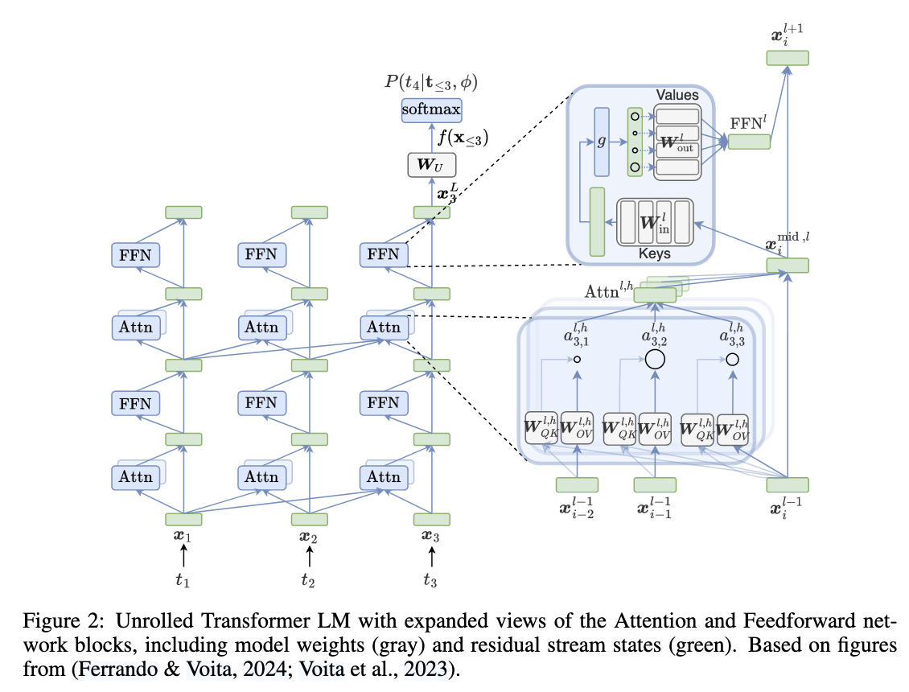

Create virtual environment, `python=3.11` and install `requirements.txt`. 

## Log
- Never dig into scaling law papers before. I can understand the conclusions but having trouble to really appreciate nuances. 
- I don't get 90% of the paper from the first read few days ago. Didn't even have general idea about SAE, and linear representation hypo and superposition hypo. After few more background papers, today on the second read, I feel way better but still lack so much background knowledge mentioned in the evaluation section. It's critical to see what's wrong right, what's missing and propose possible solutions. 
- Like first day to medical school and wow human body is complicated ... 
- Ok, made a huge logical mistake. SAE is not small AT ALL. I was an idiot and no wonder people in frontier labs are screaming engineering challenge of scaling SAE.
    - gpt2-small has `163m` params, with `d_model=768`.
    - The largest SAE has ~128k `2**17` latents, meaning ~`2**17 * 768 * 2 = 200m` params ... 128k is SMALL dictionary. 
    - I don't know `d_model` of Sonnet 3, just assume `8192`. The largest SAE in the paper is ~34m, which means ~`2**25 * 8192 * 2 = 550b` params ... WTH
- The main demo notebook for `transformer_lens` is long and packed. Let's skim through and try to catch main points as much as possible. Then divide and reproduce on the second round. 
- With `t_lens` package, I could see a path to reproduce 4.1 `downstream loss`, and 4.5 `ablation sparsity`. Don't understand the other two enough. Forget about training and scaling law for now. Focus on what's feasible in front of me.
- At this point, I've implemented gpt2 style transformer from scratch many times, and I still feel there is so much I don't understand about the model. Residual stream and autoregressive multihead attention are really ... deep. 
- 